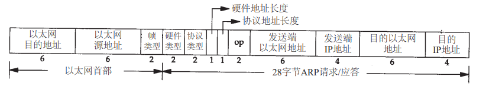

# ARP：地址解析协议

可直接互相通信的两个终端，必须基于MAC地址进行通信，而MAC地址在网卡出厂时被确定并写定在网卡硬件中的，共48位。各终端会定期广播ARP报文，向周围潜在的终端提供其MAC地址信息，接收到该ARP报文的终端会对其回复自己的MAC地址，这样各邻居终端就会知道彼此的MAC通信地址了。

ARP报文格式：



补充net.c中net_tx_arp中arp报文的源MAC地址（sha）、目的MAC地址（sha）、源IP地址（sip）、目的IP地址（tip）。

```c
// sends an ARP packet
static int
net_tx_arp(uint16 op, uint8 dmac[ETHADDR_LEN], uint32 dip)
{
  struct mbuf *m;
  struct arp *arphdr;

  m = mbufalloc(MBUF_DEFAULT_HEADROOM);
  if (!m)
    return -1;

  // generic part of ARP header
  arphdr = mbufputhdr(m, *arphdr);
  arphdr->hrd = htons(ARP_HRD_ETHER);
  arphdr->pro = htons(ETHTYPE_IP);
  arphdr->hln = ETHADDR_LEN;
  arphdr->pln = sizeof(uint32);
  arphdr->op = htons(op);

  // todo：补充arp字段 源MAC地址（sha）、目的MAC地址（sha）、
  //      源IP地址（sip）、目的IP地址（tip）

  // header is ready, send the packet
  net_tx_eth(m, ETHTYPE_ARP);
  return 0;
}
```

通过arptests命令执行一次测试。执行程序后通过执行cat /proc/net/arp查看docker终端是否已记录xv6的MAC地址。